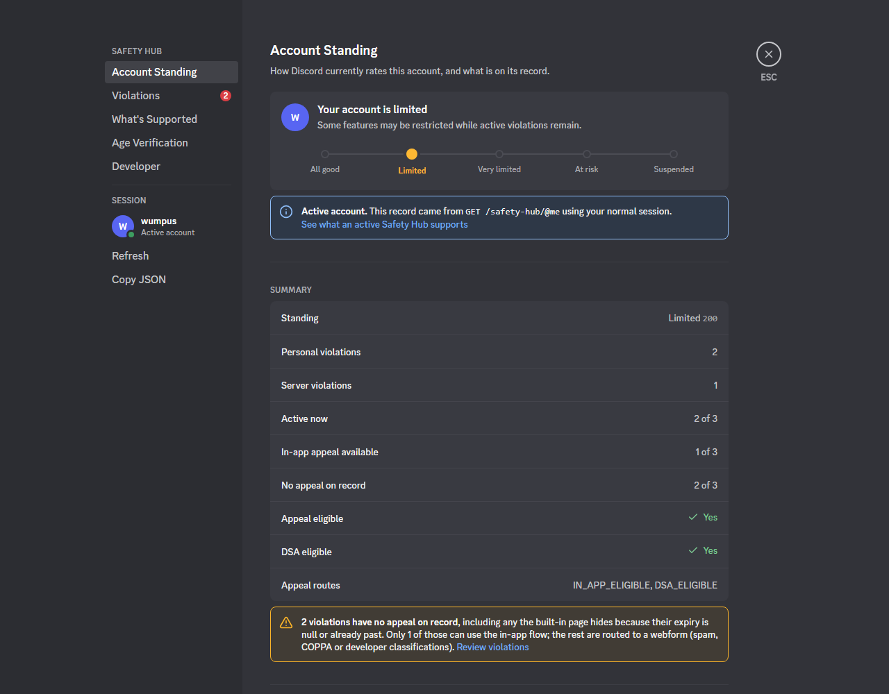
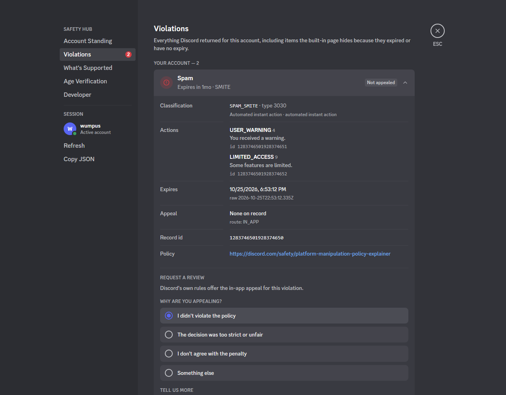
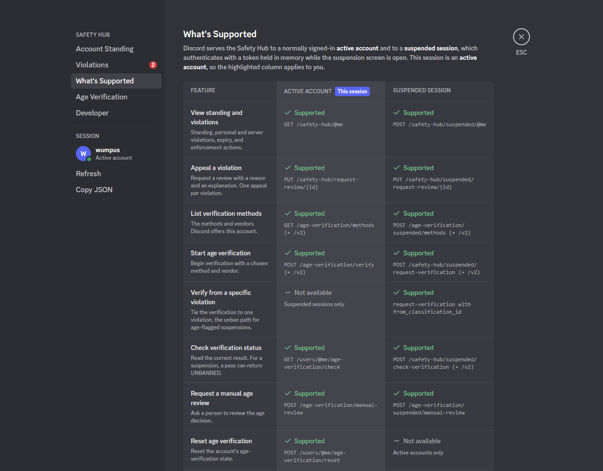

# Safety Hub Expanded

**See exactly what Discord has on your account, and appeal it from the same page.**

<picture>
  <source media="(prefers-color-scheme: light)" srcset="docs/screenshots/overview-light.png">
  
</picture>

Screenshots use sample data.

---

Did you know Discord's apps know **569 different violation classifications**? `SPAM_SMITE`. `PLATFORM_BAN_EVASION_ADMIN`. `OWNER_OF_VIOLATIVE_GUILD_MEDIUM_RISK`. Hundreds more.

When your account gets warned, limited, or suspended, Discord's Safety Hub gives you a short summary. It doesn't tell you which of those 569 you got, which of Discord's systems flagged you, or that some violations don't appear on the page at all.

If you've ever wondered what *specifically* got you, this will show you. Paste one file into your browser's console on discord.com and you'll get the full record Discord sends your account, decoded. Then you can **submit an appeal right from the page**.

## What you'll see

- **The exact classification.** Each violation's internal name, such as `SPAM_SMITE`, looked up from the 569 types Discord's apps ship.
- **Where it came from.** Whether automated detection flagged it, an automatic action applied it, a person on Discord's team decided it, or it came from a server you owned or joined. This is read from the classification's code, so treat it as a strong hint, not a guarantee.
- **Everything on record.** That includes violations the built-in page hides because they've expired or have no expiry date.
- **Every enforcement action.** Warnings, limited access, temporary bans, and content removals.
- **Server violations.** Penalties tied to a server, and whether Discord has you on record as its owner or a member.

It works on **any account**. If you're signed in normally, you'll see your standing (All good, Limited, Very limited, At risk, or Suspended) and anything on your record. If you're suspended, sign in until Discord shows the suspension screen and the page uses that instead.

## Appeal right from the page

Open any violation, pick a reason, explain what happened, and press **Submit appeal**. The page sends the same appeal request Discord's own app sends, whether your account is active or suspended.

It also tells you when Discord's app *wouldn't* offer an appeal button, and why: the violation was already appealed, it routes to a support form, or your account isn't marked as appeal-eligible. The form is still there if you want to try, but Discord may refuse it.

> [!TIP]
> Each violation can only be appealed once, so take your time with the explanation. The page asks you to confirm before anything is sent.

<table>
  <tr>
    <td width="50%"></td>
    <td width="50%"></td>
  </tr>
  <tr>
    <td align="center">Each violation, decoded, with an appeal form</td>
    <td align="center">What your session can do, next to the other kind</td>
  </tr>
</table>

## Try it

> [!WARNING]
> **Read before you paste.** Pasting code into your browser console gives it full access to your account, and scammers use this exact trick. Only run code you've read and trust.
>
> This script is one readable file with no dependencies. It only talks to Discord's API (and hCaptcha, if Discord asks you to solve a CAPTCHA), and it never saves or sends your token anywhere else. Running scripts in Discord may be against Discord's Terms of Service, so use it at your own risk.

1. Open [discord.com/app](https://discord.com/app) in a desktop browser and sign in. Discord's desktop app hides the console by default, so use a browser.
   - **Suspended?** Sign in until Discord shows its suspension screen, and stay on that screen.
2. Open the developer console: <kbd>F12</kbd>, or <kbd>Ctrl</kbd>+<kbd>Shift</kbd>+<kbd>J</kbd> on Windows and Linux, or <kbd>Cmd</kbd>+<kbd>Option</kbd>+<kbd>J</kbd> on macOS.
3. Open [`safety-hub.js`](safety-hub.js), read it, then copy the whole file and paste it into the console. Chrome may ask you to type `allow pasting` first.
4. Press <kbd>Enter</kbd>. The page opens over Discord. Press <kbd>Esc</kbd> or the close button to leave.

## What's inside

The page is laid out like Discord's User Settings and uses Discord's own theme colors, so it matches whatever theme you use.

| Page | What it shows |
| --- | --- |
| **Account Standing** | Your standing on Discord's five-step scale and a summary of your record |
| **Violations** | Every personal and server violation. Open one to see its details and appeal it. |
| **What's Supported** | What an active account and a suspended session can each do, with yours highlighted |
| **Age Verification** | Check your status, list methods, start verification, or ask for a manual review |
| **Developer** | Send your own requests to Discord's API and view the raw response |

## FAQ

<b>Will this get me unbanned?</b>

No. It can't change a moderation decision. It shows you your record and lets you send the same appeal and age-verification requests Discord's own apps send. Whether an appeal succeeds is up to Discord.

<b>I'm not banned. Is this useful to me?</b>

Yes. Discord tracks standing and violations on every account. You'll see where you sit on the scale and anything on your record, including items that have expired.

<b>Where does the number 569 come from?</b>

It's the number of classification types in the list Discord's apps ship with. By code range: 222 come from decisions by Discord's team, 129 from its internal admin tools, 126 from automated detection and base policy categories, 61 from automatic instant actions, and 31 from server, app, and test categories.

<b>Is my token safe?</b>

The script uses your session only to make requests to Discord's own API, the same way Discord's app does. Nothing is saved, logged, or sent to any other site. The file is short enough to check this yourself, and you should.

## Disclaimer

> [!IMPORTANT]
> This is completely AI generated, and I do not condone nor am I responsible for any unsolicited or unwanted requests in Discord's API. For takedown, contact [quiving@getsolara.dev](mailto:quiving@getsolara.dev).

Not affiliated with or endorsed by Discord. "Discord" is a trademark of Discord Inc.

---

How it works, endpoint details, and development notes are in [docs/TECHNICAL.md](docs/TECHNICAL.md). Endpoint details come from [Wumpus-Central/discord-mobile-datamining](https://github.com/Wumpus-Central/discord-mobile-datamining).
